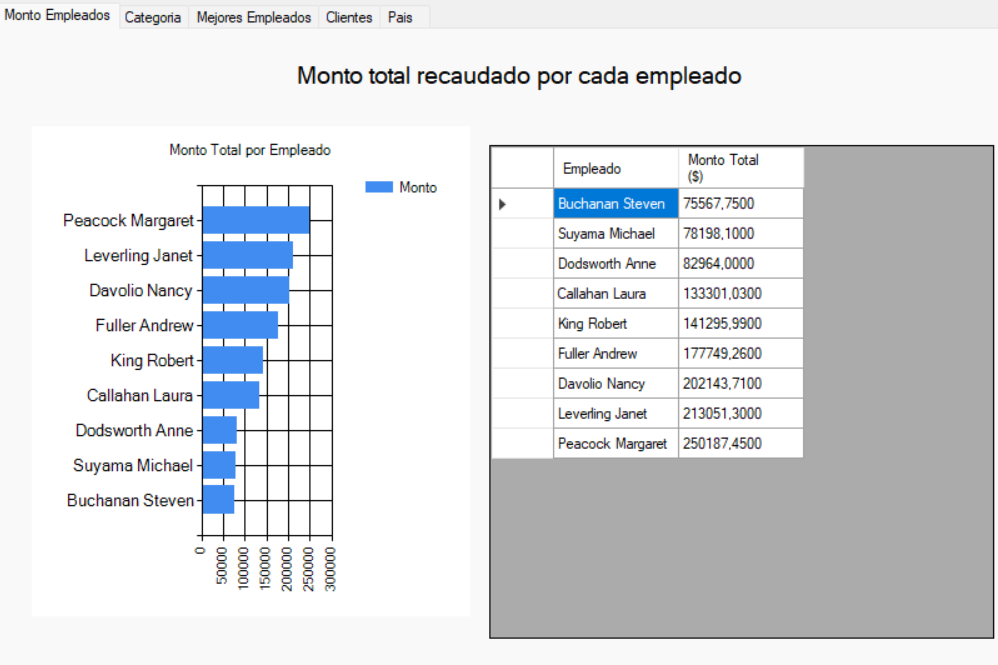
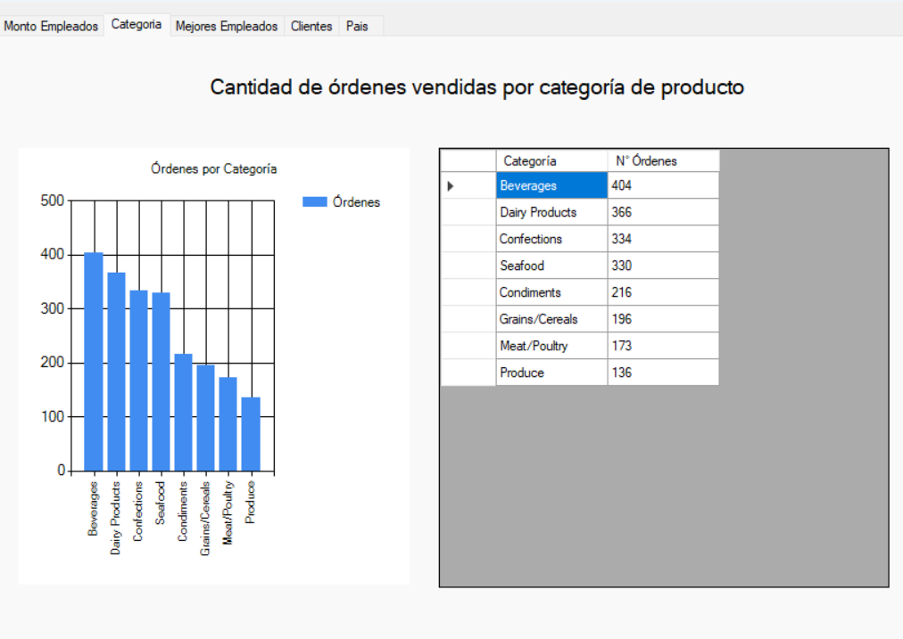
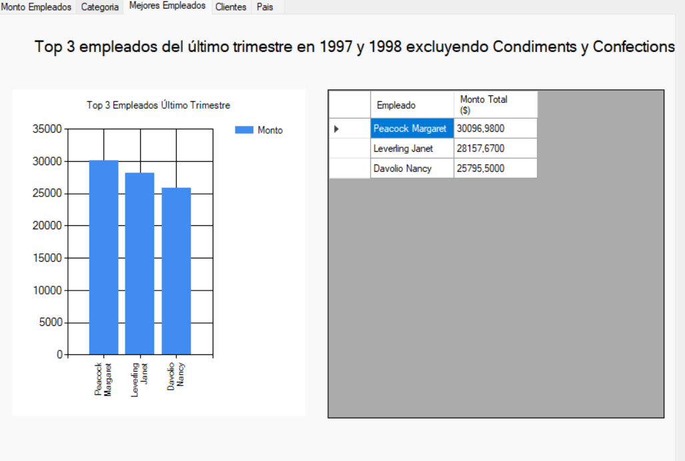
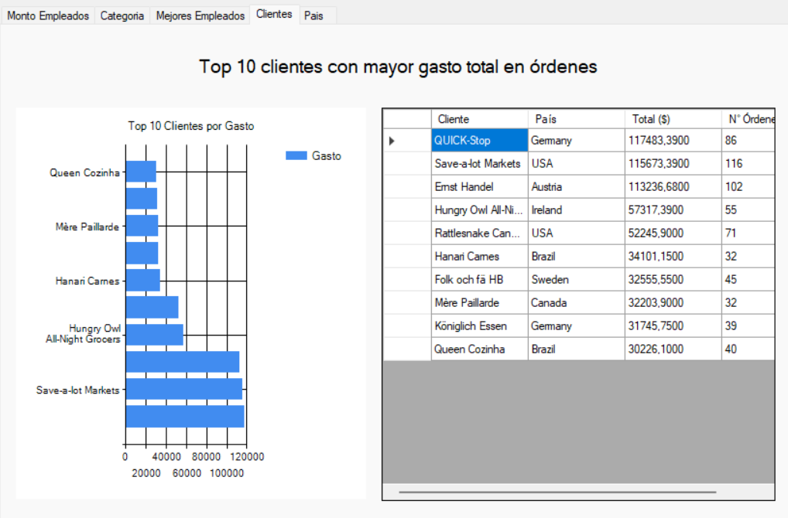
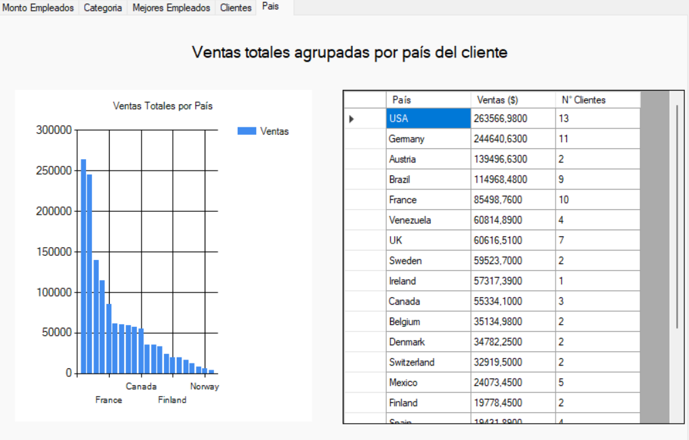

# Capítulo 7: Casos de Estudio Aplicados

## 1. ¿Por qué Casos de Estudio?

Los capítulos anteriores explican cada técnica de LINQ de forma aislada. En la práctica profesional, una misma operación puede implementarse de maneras distintas dependiendo del contexto y la tecnología elegida.

Esta sección presenta cuatro proyectos reales que demuestran el uso de LINQ en diferentes escenarios: gestión de pacientes (comparando tres tecnologías), reportes gerenciales con gráficos (Northwind), control de inventario de productos y sistema de biblioteca con préstamos.

---

## 2. Caso de Estudio 1: GestionUsuarios — Tres Enfoques de CRUD para Pacientes

**Contexto:** Una clínica necesita registrar, listar, actualizar y eliminar pacientes asociados a un género. Se implementó el mismo CRUD con tres tecnologías distintas para comparar su evolución histórica.

> **Referencia:** Proyecto `GestionUsuarios`, archivo `GestionUsuariosEntidades/PacienteEntidades.cs`.

```csharp
public class PacienteEntidades
{
    public int ID { get; set; }
    public int Id_Genero { get; set; }
    public string Genero { get; set; }
    public string Nombre { get; set; }
    public string Apellido { get; set; }
    public string Cedula { get; set; }
    public string Direccion { get; set; }
    public string Telefono { get; set; }
    public DateTime FechaNacimiento { get; set; }
    public bool Afiliado { get; set; }
    public string CodigoIESS { get; set; }
}
```

---

### 2.1. Enfoque A: ADO.NET Puro

> **Referencia:** Proyecto `GestionUsuarios`, archivo `GestionUsuariosDatos/PacienteDatos.cs`.

#### CREATE — Nuevo()
```csharp
public static PacienteEntidades Nuevo(PacienteEntidades paciente)
{
    try
    {
        SqlConnection conexion = new SqlConnection(
            Properties.Settings.Default.ConexionBD);
        conexion.Open();
        SqlCommand cmd = new SqlCommand();
        cmd.Connection = conexion;
        cmd.CommandType = CommandType.Text;
        cmd.CommandText = @"INSERT INTO [dbo].[Pacientes]
                           ([Id_Genero],[apellido],[nombres],[cedula],
                            [telefono],[fechaNacimiento],[direccion],
                            [CodigoIESS],[Afiliado])
                            VALUES
                           (@Id_Genero,@apellido,@nombres,@cedula,@telefono,
                            @fechaNacimiento,@direccion,@CodigoIESS,@Afiliado);
                            SELECT SCOPE_IDENTITY()";
        cmd.Parameters.AddWithValue("@Id_Genero", paciente.Id_Genero);
        cmd.Parameters.AddWithValue("@apellido", paciente.Apellido);
        cmd.Parameters.AddWithValue("@nombres", paciente.Nombre);
        cmd.Parameters.AddWithValue("@cedula", paciente.Cedula);
        cmd.Parameters.AddWithValue("@telefono", paciente.Telefono);
        cmd.Parameters.AddWithValue("@fechaNacimiento", paciente.FechaNacimiento);
        cmd.Parameters.AddWithValue("@direccion", paciente.Direccion);
        cmd.Parameters.AddWithValue("@CodigoIESS", paciente.CodigoIESS);
        cmd.Parameters.AddWithValue("@Afiliado", paciente.Afiliado);
        var id_paciente = Convert.ToInt32(cmd.ExecuteScalar());
        paciente.ID = id_paciente;
        conexion.Close();
        return paciente;
    }
    catch (Exception e) { var error = e.Message; return null; }
}
```

#### READ — DevolverListaPaciente()
```csharp
public static List<PacienteEntidades> DevolverListaPaciente()
{
    try
    {
        List<PacienteEntidades> listaPacientes = new List<PacienteEntidades>();
        SqlConnection conexion = new SqlConnection(
            Properties.Settings.Default.ConexionBD);
        conexion.Open();
        SqlCommand cmd = new SqlCommand();
        cmd.Connection = conexion;
        cmd.CommandType = CommandType.Text;
        cmd.CommandText = @"SELECT p.[id],p.[Id_Genero],g.[nombre] as genero,
                                   p.[apellido],p.[nombres],p.[cedula],
                                   p.[telefono],p.[fechaNacimiento],p.[direccion],
                                   p.[CodigoIESS],p.[Afiliado]
                            FROM [dbo].[Pacientes] p
                            INNER JOIN Genero g ON p.Id_Genero = g.id";
        using (var dr = cmd.ExecuteReader())
        {
            while (dr.Read())
            {
                PacienteEntidades paciente = new PacienteEntidades();
                paciente.ID = Convert.ToInt32(dr["id"].ToString());
                paciente.Id_Genero = Convert.ToInt32(dr["Id_Genero"].ToString());
                paciente.Genero = dr["genero"].ToString();
                paciente.Nombre = dr["nombres"].ToString();
                paciente.Apellido = dr["apellido"].ToString();
                paciente.Cedula = dr["cedula"].ToString();
                paciente.FechaNacimiento = Convert.ToDateTime(dr["fechaNacimiento"].ToString());
                paciente.Telefono = dr["telefono"].ToString();
                paciente.Direccion = dr["direccion"].ToString();
                paciente.Afiliado = Convert.ToBoolean(dr["Afiliado"].ToString());
                paciente.CodigoIESS = dr["CodigoIESS"].ToString();
                listaPacientes.Add(paciente);
            }
        }
        conexion.Close();
        return listaPacientes;
    }
    catch (Exception e) { var error = e.Message; return null; }
}
```

#### UPDATE — Actualizar()
```csharp
public static PacienteEntidades Actualizar(PacienteEntidades paciente)
{
    try
    {
        SqlConnection conexion = new SqlConnection(
            Properties.Settings.Default.ConexionBD);
        conexion.Open();
        SqlCommand cmd = new SqlCommand();
        cmd.Connection = conexion;
        cmd.CommandType = CommandType.Text;
        cmd.CommandText = @"UPDATE [dbo].[Pacientes]
                            SET [Id_Genero]=@id_genero,
                                [apellido]=@apellido,
                                [nombres]=@nombres,
                                [cedula]=@cedula,
                                [telefono]=@telefono,
                                [fechaNacimiento]=@fechaNacimiento,
                                [direccion]=@direccion,
                                [CodigoIESS]=@CodigoIESS,
                                [Afiliado]=@Afiliado
                            WHERE id=@id";
        cmd.Parameters.AddWithValue("@id_genero", paciente.Id_Genero);
        cmd.Parameters.AddWithValue("@nombres", paciente.Nombre);
        cmd.Parameters.AddWithValue("@apellido", paciente.Apellido);
        cmd.Parameters.AddWithValue("@cedula", paciente.Cedula);
        cmd.Parameters.AddWithValue("@fechaNacimiento", paciente.FechaNacimiento);
        cmd.Parameters.AddWithValue("@telefono", paciente.Telefono);
        cmd.Parameters.AddWithValue("@direccion", paciente.Direccion);
        cmd.Parameters.AddWithValue("@CodigoIESS", paciente.CodigoIESS);
        cmd.Parameters.AddWithValue("@Afiliado", paciente.Afiliado);
        cmd.Parameters.AddWithValue("@id", paciente.ID);
        cmd.ExecuteNonQuery();
        conexion.Close();
        return paciente;
    }
    catch (Exception e) { string error = e.Message; return null; }
}
```

#### DELETE — EliminarPacientePorID()
```csharp
public static bool EliminarPacientePorID(int id)
{
    try
    {
        SqlConnection conexion = new SqlConnection(
            Properties.Settings.Default.ConexionBD);
        conexion.Open();
        SqlCommand cmd = new SqlCommand();
        cmd.Connection = conexion;
        cmd.CommandType = CommandType.Text;
        cmd.CommandText = @"DELETE FROM [dbo].[Pacientes] WHERE id=@id";
        cmd.Parameters.AddWithValue("@id", id);
        var filasAfectadas = cmd.ExecuteNonQuery();
        return filasAfectadas > 0;
    }
    catch (Exception e) { string error = e.Message; return false; }
}
```

**Análisis ADO.NET:** Todo el SQL es texto plano. Los errores de nombres de columnas solo se detectan en tiempo de ejecución. El `INNER JOIN` con `Genero` se hace manualmente dentro del SQL.

---

### 2.2. Enfoque B: LINQ to SQL

> **Referencia:** Proyecto `GestionUsuarios`, archivo `GestionUsuarios_DatosLinq/PacienteDatos.cs`.

#### CREATE — Nuevo()
```csharp
public static PacienteEntidades Nuevo(PacienteEntidades paciente)
{
    try
    {
        Pacientes _pacienteLinQ = new Pacientes();
        _pacienteLinQ.Id_Genero = paciente.Id_Genero;
        _pacienteLinQ.cedula = paciente.Cedula;
        _pacienteLinQ.nombres = paciente.Nombre;
        _pacienteLinQ.apellido = paciente.Apellido;
        _pacienteLinQ.telefono = paciente.Telefono;
        _pacienteLinQ.direccion = paciente.Direccion;
        _pacienteLinQ.fechaNacimiento = paciente.FechaNacimiento;
        _pacienteLinQ.Afiliado = paciente.Afiliado;
        _pacienteLinQ.CodigoIESS = paciente.CodigoIESS;
        using (Programacion_avanzadaDataContext contexto =
               new Programacion_avanzadaDataContext())
        {
            contexto.Pacientes.InsertOnSubmit(_pacienteLinQ);
            contexto.SubmitChanges();
        }
        return paciente;
    }
    catch (Exception) { throw; }
}
```

#### READ — DevolverListaPaciente()
```csharp
public static List<PacienteEntidades> DevolverListaPaciente()
{
    try
    {
        List<PacienteEntidades> listaPacienteEntidades = new List<PacienteEntidades>();
        List<Pacientes> listaPaciente = new List<Pacientes>();
        using (Programacion_avanzadaDataContext contexto =
               new Programacion_avanzadaDataContext())
        {
            // Query Syntax de LINQ
            var resultado = from p in contexto.Pacientes select p;
            listaPaciente = resultado.ToList();
        }
        // El género se resuelve con llamada separada porque LINQ to SQL
        // no soporta .Include() como Entity Framework
        foreach (var item in listaPaciente)
        {
            listaPacienteEntidades.Add(new PacienteEntidades(
                item.id, item.Id_Genero ?? 0,
                GeneroDatos.DevolverNombreGeneroPorId(item.Id_Genero ?? 0),
                item.nombres, item.apellido, item.cedula,
                item.direccion, item.telefono, item.fechaNacimiento,
                item.Afiliado ?? false, item.CodigoIESS));
        }
        return listaPacienteEntidades;
    }
    catch (Exception ex) { var error = ex.Message; throw; }
}
```

#### UPDATE — Actualizar()
```csharp
public static PacienteEntidades Actualizar(PacienteEntidades paciente)
{
    try
    {
        using (Programacion_avanzadaDataContext contexto =
               new Programacion_avanzadaDataContext())
        {
            Pacientes _pacienteLinQ = contexto.Pacientes
                .FirstOrDefault(p => p.id == paciente.ID);
            _pacienteLinQ.Id_Genero = paciente.Id_Genero;
            _pacienteLinQ.cedula = paciente.Cedula;
            _pacienteLinQ.nombres = paciente.Nombre;
            _pacienteLinQ.apellido = paciente.Apellido;
            _pacienteLinQ.telefono = paciente.Telefono;
            _pacienteLinQ.direccion = paciente.Direccion;
            _pacienteLinQ.fechaNacimiento = paciente.FechaNacimiento;
            _pacienteLinQ.Afiliado = paciente.Afiliado;
            _pacienteLinQ.CodigoIESS = paciente.CodigoIESS;
            contexto.SubmitChanges();
            return paciente;
        }
    }
    catch (Exception) { throw; }
}
```

#### DELETE — EliminarPacientePorID()
```csharp
public static bool EliminarPacientePorID(int id)
{
    try
    {
        using (Programacion_avanzadaDataContext contexto =
               new Programacion_avanzadaDataContext())
        {
            Pacientes pacienteLinQ = contexto.Pacientes
                .FirstOrDefault(p => p.id == id);
            contexto.Pacientes.DeleteOnSubmit(pacienteLinQ);
            contexto.SubmitChanges();
            return true;
        }
    }
    catch (Exception) { return false; }
}
```

**Análisis LINQ to SQL:** No hay SQL en texto. `InsertOnSubmit`, `DeleteOnSubmit` y `SubmitChanges` reemplazan los comandos manuales. La relación con `Genero` aún requiere una llamada separada a `GeneroDatos.DevolverNombreGeneroPorId()`.

---

### 2.3. Enfoque C: Entity Framework

> **Referencia:** Proyecto `GestionUsuarios`, archivo `GestionUsuariosDatosEF/PacienteDatos.cs`.

#### CREATE — Nuevo()
```csharp
public static PacienteEntidades Nuevo(PacienteEntidades paciente)
{
    try
    {
        Pacientes _pacienteEF = new Pacientes();
        _pacienteEF.Id_Genero = paciente.Id_Genero;
        _pacienteEF.cedula = paciente.Cedula;
        _pacienteEF.nombres = paciente.Nombre;
        _pacienteEF.apellido = paciente.Apellido;
        _pacienteEF.telefono = paciente.Telefono;
        _pacienteEF.direccion = paciente.Direccion;
        _pacienteEF.fechaNacimiento = paciente.FechaNacimiento;
        _pacienteEF.Afiliado = paciente.Afiliado;
        _pacienteEF.CodigoIESS = paciente.CodigoIESS;
        using (Programacion_avanzadaEntities contexto =
               new Programacion_avanzadaEntities())
        {
            contexto.Pacientes.Add(_pacienteEF);
            contexto.SaveChanges();
        }
        paciente.ID = _pacienteEF.id;
        return paciente;
    }
    catch (Exception) { throw; }
}
```

#### READ — DevolverListaPaciente()
```csharp
public static List<PacienteEntidades> DevolverListaPaciente()
{
    try
    {
        List<PacienteEntidades> listaPacienteEntidades = new List<PacienteEntidades>();
        using (Programacion_avanzadaEntities contexto =
               new Programacion_avanzadaEntities())
        {
            // .Include("Genero") trae la relación en una sola consulta SQL
            var lista = contexto.Pacientes
                .Include("Genero")
                .ToList();
            foreach (var item in lista)
            {
                listaPacienteEntidades.Add(new PacienteEntidades(
                    item.id, item.Id_Genero ?? 0,
                    item.Genero.Nombre,
                    item.nombres, item.apellido, item.cedula,
                    item.direccion, item.telefono, item.fechaNacimiento,
                    item.Afiliado ?? false, item.CodigoIESS ?? ""));
            }
            return listaPacienteEntidades;
        }
    }
    catch (Exception) { throw; }
}
```

#### UPDATE — Actualizar()
```csharp
public static PacienteEntidades Actualizar(PacienteEntidades paciente)
{
    try
    {
        Pacientes _pacienteEF = new Pacientes();
        _pacienteEF.id = paciente.ID;
        _pacienteEF.Id_Genero = paciente.Id_Genero;
        _pacienteEF.cedula = paciente.Cedula;
        _pacienteEF.nombres = paciente.Nombre;
        _pacienteEF.apellido = paciente.Apellido;
        _pacienteEF.telefono = paciente.Telefono;
        _pacienteEF.direccion = paciente.Direccion;
        _pacienteEF.fechaNacimiento = paciente.FechaNacimiento;
        _pacienteEF.Afiliado = paciente.Afiliado;
        _pacienteEF.CodigoIESS = paciente.CodigoIESS;
        using (Programacion_avanzadaEntities contexto =
               new Programacion_avanzadaEntities())
        {
            contexto.Pacientes.AddOrUpdate(_pacienteEF);
            contexto.SaveChanges();
        }
        return paciente;
    }
    catch (Exception) { throw; }
}
```

#### DELETE — EliminarPacientePorID()
```csharp
public static bool EliminarPacientePorID(int id)
{
    try
    {
        using (Programacion_avanzadaEntities contexto =
               new Programacion_avanzadaEntities())
        {
            var _pacienteEF = contexto.Pacientes
                .FirstOrDefault(p => p.id == id);
            contexto.Pacientes.Remove(_pacienteEF);
            contexto.SaveChanges();
            return true;
        }
    }
    catch (Exception) { return false; }
}
```

**Análisis Entity Framework:** El más limpio de los tres. `.Include("Genero")` elimina llamadas separadas. `AddOrUpdate` simplifica el UPDATE. `SaveChanges()` unifica todos los comandos.

---

### 2.4. Tabla Comparativa CRUD Completa

| Operación | ADO.NET Puro | LINQ to SQL | Entity Framework |
| :--- | :--- | :--- | :--- |
| **INSERT** | `ExecuteScalar()` + SQL texto | `InsertOnSubmit()` + `SubmitChanges()` | `Add()` + `SaveChanges()` |
| **SELECT todos** | `SqlDataReader` + `while(dr.Read())` | `from p in contexto.Pacientes select p` | `.Include("Genero").ToList()` |
| **SELECT por ID** | SQL con `WHERE id=@id` en texto | `.FirstOrDefault(p => p.id == id)` | `.Include("Genero").FirstOrDefault(...)` |
| **UPDATE** | `ExecuteNonQuery()` + SQL texto | `.FirstOrDefault()` + modificar + `SubmitChanges()` | `AddOrUpdate()` + `SaveChanges()` |
| **DELETE** | `ExecuteNonQuery()` + SQL texto | `DeleteOnSubmit()` + `SubmitChanges()` | `Remove()` + `SaveChanges()` |
| **Relación Genero** | `INNER JOIN` manual en SQL | Llamada separada `GeneroDatos.DevolverNombreGeneroPorId()` | `.Include("Genero")` automático |
| **Errores detectados** | Tiempo de ejecución | Tiempo de compilación | Tiempo de compilación |

---

## 3. Caso de Estudio 2: Northwind — Reportes Gerenciales con Gráficos

**Contexto:** La empresa Northwind necesita cinco reportes gerenciales desde Windows Forms. Cada reporte usa LINQ con `GroupBy`, `Sum`, `Count`, `OrderBy` y `Take`, mostrando resultados en un `Chart` y un `DataGridView`.

**Capas involucradas:**
- `Northwind_Entidades` → DTOs (`MontoEmpleado`, `CantidadCategoria`, `MejorEmpleadoTrimestre`, `ClienteGasto`, `VentaPais`)
- `Datos_LinQ` / `Northwind_Datos` → consultas LINQ contra la base de datos
- `Northwind_Logica` → expone los métodos a la presentación
- `Northwind_Presentacion` → `TabControl` con `Chart` + `DataGridView` por reporte

---

### 3.1. Reporte: Monto Total por Empleado

**Técnicas LINQ:** `GroupBy` + `Sum` + `OrderBy`

> **Referencia:** Proyecto `Northwind`, archivo `Datos_LinQ/MontoEmpleado_Datos.cs`.

```csharp
var resultado = contexto.vw_GestionOrdenesPorEmpleados
    .GroupBy(v => v.EmpleadoNombre)
    .Select(grupo => new MontoEmpleado
    {
        NombreEmpleado = grupo.Key,
        MontoTotal = grupo.Sum(v => v.montoReacudado) ?? 0
    })
    .OrderBy(x => x.MontoTotal)
    .ToList();
```



*Figura 1: Monto total recaudado por empleado. Peacock Margaret lidera con $250,187.45.*

---

### 3.2. Reporte: Órdenes por Categoría de Producto

**Técnicas LINQ:** `GroupBy` + `Count` + `OrderByDescending`

> **Referencia:** Proyecto `Northwind`, archivo `Northwind_Logica/CantidadCategoria_Logica.cs`.

```csharp
var resultado = _context.OrderDetails
    .GroupBy(detalle => detalle.Product.Category.CategoryName)
    .Select(grupo => new CantidadCategoria
    {
        NombreCategoria = grupo.Key,
        NumeroOrdenes = grupo.Count()
    })
    .OrderByDescending(c => c.NumeroOrdenes)
    .ToList();
```



*Figura 2: Beverages lidera con 404 órdenes, seguido de Dairy Products con 366.*

---

### 3.3. Reporte: Top 3 Mejores Empleados del Último Trimestre

**Técnicas LINQ:** `Where` + `Any` + `GroupBy` + `Sum` + `OrderByDescending` + `Take(3)`

> **Referencia:** Proyecto `Northwind`, archivo `Northwind_Logica/MejorEmpleadoTrimestre_Logica.cs`.

```csharp
var resultado = _context.Orders
    .Where(o => (o.OrderDate.Value.Month >= 10) &&
                (o.OrderDate.Value.Year == 1997 ||
                 o.OrderDate.Value.Year == 1998) &&
                !o.Order_Details.Any(od =>
                    od.Product.Category.CategoryName == "Condiments" ||
                    od.Product.Category.CategoryName == "Confections"))
    .GroupBy(o => o.Employee.FirstName + " " + o.Employee.LastName)
    .Select(grupo => new MejorEmpleadoTrimestre
    {
        NombreEmpleado = grupo.Key,
        MontoTotalOrden = grupo.Sum(o =>
            o.Order_Details.Sum(od => od.UnitPrice * od.Quantity))
    })
    .OrderByDescending(e => e.MontoTotalOrden)
    .Take(3)
    .ToList();
```



*Figura 3: Top 3 empleados excluyendo Condiments y Confections. Peacock Margaret: $30,096.98.*

---

### 3.4. Reporte: Top 10 Clientes con Mayor Gasto

**Técnicas LINQ:** `GroupBy` con llave compuesta + `Sum` + `Count` + `OrderByDescending` + `Take(10)`

> **Referencia:** Proyecto `Northwind`, archivo `Datos_LinQ/ClienteGastos_Datos.cs`.

```csharp
var consulta = contexto.vw_GestionOrdenesPorEmpleados
    .GroupBy(v => new { v.CompanyName, v.Country })
    .Select(grupo => new ClienteGasto
    {
        NombreCliente = grupo.Key.CompanyName,
        Pais = grupo.Key.Country,
        TotalGastado = grupo.Sum(v => v.montoReacudado) ?? 0,
        NumeroOrdenes = grupo.Count()
    })
    .OrderByDescending(x => x.TotalGastado)
    .Take(10)
    .ToList();
```



*Figura 4: QUICK-Stop (Alemania) lidera con $117,483.39 en 86 órdenes.*

---

### 3.5. Reporte: Ventas Totales por País

**Técnicas LINQ:** `GroupBy` + `Sum` + `Distinct().Count()` + `OrderByDescending`

> **Referencia:** Proyecto `Northwind`, archivo `Northwind_Logica/VentaPais_Logica.cs`.

```csharp
var reporte = _context.Orders
    .GroupBy(orden => orden.Customer.Country)
    .Select(grupo => new VentaPais
    {
        Pais = grupo.Key,
        TotalVentas = grupo.Sum(o =>
            o.Order_Details.Sum(od => od.UnitPrice * od.Quantity)),
        NumeroClientes = grupo.Select(o => o.CustomerID)
                              .Distinct().Count()
    })
    .OrderByDescending(v => v.TotalVentas)
    .ToList();
```



*Figura 5: USA lidera con $263,566.98 y 13 clientes únicos.*

---

### 3.6. Resumen de Técnicas por Reporte

| Reporte | GroupBy | Sum | Count | OrderBy | Take | Where |
| :--- | :---: | :---: | :---: | :---: | :---: | :---: |
| Monto por Empleado | ✓ | ✓ | | ✓ | | |
| Órdenes por Categoría | ✓ | | ✓ | ✓ | | |
| Top 3 Empleados Trimestre | ✓ | ✓ | | ✓ | ✓ | ✓ |
| Top 10 Clientes | ✓ | ✓ | ✓ | ✓ | ✓ | |
| Ventas por País | ✓ | ✓ | ✓ | ✓ | | |

---

## 4. Caso de Estudio 3: InventarioApp — Control de Productos

**Contexto:** Una tienda necesita gestionar su inventario de productos agrupados por categoría, controlar stock crítico y procesar ventas con validaciones de negocio.

> **Referencia:** Proyecto `InventarioApp`, archivo `Inventario.Entidades/ProductoEntidad.cs`.

```csharp
public class ProductoEntidad
{
    public int ID { get; set; }
    public string Nombre { get; set; }
    public string Categoria { get; set; }
    public decimal Precio { get; set; }
    public int Stock { get; set; }
}

public class ResumenCategoriaEntidad
{
    public string NombreCategoria { get; set; }
    public int TotalProductos { get; set; }
    public decimal ValorTotalInventario { get; set; }
    public decimal PrecioPromedio { get; set; }
    public int StockMinimo { get; set; }
}
```

### Capa de Datos — LINQ to Entities

> **Referencia:** Proyecto `InventarioApp`, archivo `Inventario.Datos/ProductoDatos.cs`.

#### READ — ObtenerTodos()
```csharp
public static List<ProductoEntidad> ObtenerTodos()
{
    using (var contexto = new InventarioContext())
    {
        return contexto.Productos
            .OrderBy(p => p.Nombre)
            .Select(p => new ProductoEntidad
            {
                ID = p.ID,
                Nombre = p.Nombre,
                Categoria = p.Categoria.Nombre,
                Precio = p.Precio,
                Stock = p.Stock
            })
            .ToList();
    }
}
```

#### READ — ObtenerStockBajo() (Stock Crítico)
```csharp
public static List<ProductoEntidad> ObtenerStockBajo(int umbral)
{
    using (var contexto = new InventarioContext())
    {
        return contexto.Productos
            .Where(p => p.Stock < umbral)
            .OrderBy(p => p.Stock)
            .Select(p => new ProductoEntidad
            {
                ID = p.ID,
                Nombre = p.Nombre,
                Categoria = p.Categoria.Nombre,
                Precio = p.Precio,
                Stock = p.Stock
            })
            .ToList();
    }
}
```

#### AGREGADOS — ObtenerResumenPorCategoria()
```csharp
public static List<ResumenCategoriaEntidad> ObtenerResumenPorCategoria()
{
    using (var contexto = new InventarioContext())
    {
        return contexto.Productos
            .GroupBy(p => p.Categoria.Nombre)
            .Select(grupo => new ResumenCategoriaEntidad
            {
                NombreCategoria      = grupo.Key,
                TotalProductos       = grupo.Count(),
                ValorTotalInventario = grupo.Sum(p => p.Precio * p.Stock),
                PrecioPromedio       = grupo.Average(p => p.Precio),
                StockMinimo          = grupo.Min(p => p.Stock)
            })
            .OrderByDescending(r => r.ValorTotalInventario)
            .ToList();
    }
}
```

#### CREATE — InsertarProducto()
```csharp
public static void InsertarProducto(ProductoEntidad nuevo)
{
    using (var contexto = new InventarioContext())
    {
        contexto.Productos.Add(new Producto
        {
            Nombre = nuevo.Nombre,
            Precio = nuevo.Precio,
            Stock  = nuevo.Stock
        });
        contexto.SaveChanges();
    }
}
```

#### UPDATE — ActualizarStock()
```csharp
public static bool ActualizarStock(int idProducto, int nuevaCantidad)
{
    using (var contexto = new InventarioContext())
    {
        var producto = contexto.Productos
            .FirstOrDefault(p => p.ID == idProducto);
        if (producto == null) return false;
        producto.Stock = nuevaCantidad;
        contexto.SaveChanges();
        return true;
    }
}
```

### Capa de Negocio — LINQ to Objects + Reglas

> **Referencia:** Proyecto `InventarioApp`, archivo `Inventario.Negocio/ProductoNegocio.cs`.

```csharp
// LINQ to Objects: filtra en memoria por categoría
public static List<ProductoEntidad> ObtenerPorCategoria(string categoria)
{
    List<ProductoEntidad> todos = ProductoDatos.ObtenerTodos();
    return todos
        .Where(p => p.Categoria.ToLower() == categoria.ToLower())
        .ToList();
}

// Regla de negocio: valida stock antes de procesar la venta
public static string ProcesarVenta(int idProducto, int cantidadVendida)
{
    var producto = ProductoDatos.ObtenerTodos()
        .FirstOrDefault(p => p.ID == idProducto);

    if (producto == null)
        return "Error: Producto no encontrado.";

    if (producto.Stock < cantidadVendida)
        return $"Error: Stock insuficiente. Disponible: {producto.Stock} unidades.";

    int nuevoStock = producto.Stock - cantidadVendida;
    ProductoDatos.ActualizarStock(idProducto, nuevoStock);
    return $"Venta registrada. Stock actualizado a {nuevoStock} unidades.";
}

// Expone el reporte de resumen a la Capa de Presentación
public static List<ResumenCategoriaEntidad> ObtenerResumenInventario()
{
    return ProductoDatos.ObtenerResumenPorCategoria();
}
```

**Análisis InventarioApp:** Demuestra la diferencia entre **LINQ to Entities** (en `ProductoDatos`, consulta directo a la BD) y **LINQ to Objects** (en `ProductoNegocio`, filtra en memoria sobre una `List<T>` ya cargada). El reporte `ObtenerResumenPorCategoria()` combina `Count`, `Sum`, `Average` y `Min` en una sola consulta SQL.

---

## 5. Caso de Estudio 4: BibliotecaApp — Gestión de Libros y Préstamos

**Contexto:** Una biblioteca necesita gestionar su catálogo de libros (disponibles/no disponibles), registrar préstamos y aplicar validaciones antes de insertar nuevos libros.

> **Referencia:** Proyecto `BibliotecaApp`, archivo `Biblioteca.Entidades/LibroEntidad.cs`.

```csharp
public class LibroEntidad
{
    public int ID { get; set; }
    public string Titulo { get; set; }
    public string Autor { get; set; }
    public string Genero { get; set; }
    public int AnioPub { get; set; }
    public bool Disponible { get; set; }
}

public class PrestamoEntidad
{
    public int ID { get; set; }
    public int IdLibro { get; set; }
    public string TituloLibro { get; set; }
    public string NombreUsuario { get; set; }
    public DateTime FechaPrestamo { get; set; }
    public DateTime FechaDevolucion { get; set; }
    public bool Devuelto { get; set; }
}
```

### Capa de Datos — LINQ to Entities

> **Referencia:** Proyecto `BibliotecaApp`, archivo `Biblioteca.Datos/LibroDatos.cs`.

#### READ — ObtenerLibrosDisponibles()
```csharp
public static List<LibroEntidad> ObtenerLibrosDisponibles()
{
    using (var contexto = new BibliotecaContext())
    {
        return contexto.Libros
            .Where(l => l.Disponible == true)
            .OrderBy(l => l.Titulo)
            .Select(l => new LibroEntidad
            {
                ID = l.ID,
                Titulo = l.Titulo,
                Autor = l.Autor,
                Genero = l.Genero,
                AnioPub = l.AnioPub,
                Disponible = l.Disponible
            })
            .ToList();
    }
}
```

#### READ — BuscarPorId()
```csharp
public static LibroEntidad BuscarPorId(int id)
{
    using (var contexto = new BibliotecaContext())
    {
        var libro = contexto.Libros
            .FirstOrDefault(l => l.ID == id);
        if (libro == null) return null;
        return new LibroEntidad
        {
            ID = libro.ID,
            Titulo = libro.Titulo,
            Autor = libro.Autor,
            Genero = libro.Genero,
            AnioPub = libro.AnioPub,
            Disponible = libro.Disponible
        };
    }
}
```

#### CREATE — InsertarLibro()
```csharp
public static void InsertarLibro(LibroEntidad nuevoLibro)
{
    using (var contexto = new BibliotecaContext())
    {
        var libroDb = new Libro
        {
            Titulo = nuevoLibro.Titulo,
            Autor = nuevoLibro.Autor,
            Genero = nuevoLibro.Genero,
            AnioPub = nuevoLibro.AnioPub,
            Disponible = true
        };
        contexto.Libros.Add(libroDb);
        contexto.SaveChanges();
    }
}
```

#### DELETE — EliminarLibro()
```csharp
public static bool EliminarLibro(int id)
{
    using (var contexto = new BibliotecaContext())
    {
        var libro = contexto.Libros.FirstOrDefault(l => l.ID == id);
        if (libro == null) return false;
        contexto.Libros.Remove(libro);
        contexto.SaveChanges();
        return true;
    }
}
```

### Capa de Negocio — LINQ to Objects + Validaciones

> **Referencia:** Proyecto `BibliotecaApp`, archivo `Biblioteca.Negocio/LibroNegocio.cs`.

```csharp
// LINQ to Objects: filtra por género en memoria
public static List<LibroEntidad> FiltrarPorGenero(string genero)
{
    List<LibroEntidad> todosLosLibros = LibroDatos.ObtenerLibrosDisponibles();
    return todosLosLibros
        .Where(l => l.Genero.ToLower() == genero.ToLower())
        .ToList();
}

// LINQ to Objects: agrupa y cuenta por género en memoria
// Retorna Dictionary<string, int> (Género → Cantidad)
public static Dictionary<string, int> ContarPorGenero()
{
    List<LibroEntidad> todosLosLibros = LibroDatos.ObtenerLibrosDisponibles();
    return todosLosLibros
        .GroupBy(l => l.Genero)
        .ToDictionary(g => g.Key, g => g.Count());
}

// Validaciones de negocio antes de insertar
public static string InsertarConValidacion(LibroEntidad libro)
{
    if (string.IsNullOrWhiteSpace(libro.Titulo))
        return "Error: El titulo no puede estar vacio.";

    if (libro.AnioPub < 1450 || libro.AnioPub > 2026)
        return "Error: El anio de publicacion no es valido.";

    LibroDatos.InsertarLibro(libro);
    return "Libro registrado correctamente.";
}
```

**Análisis BibliotecaApp:** Demuestra dos patrones importantes. Primero, el uso de `Where` con un booleano (`.Where(l => l.Disponible == true)`) para filtrar estado directamente en la BD. Segundo, el método `ContarPorGenero()` usa `GroupBy` + `ToDictionary()` en la Capa de Negocio sobre una lista en memoria, mostrando que no todo el procesamiento tiene que ocurrir en SQL.

---

## 6. Resumen General: Dónde se usa cada técnica LINQ

| Técnica LINQ | Proyecto | Archivo | Capítulo |
| :--- | :--- | :--- | :--- |
| SQL puro con `SqlDataReader` | GestionUsuarios | `GestionUsuariosDatos/PacienteDatos.cs` | Cap. 5 |
| `InsertOnSubmit` / `SubmitChanges` | GestionUsuarios | `GestionUsuarios_DatosLinq/PacienteDatos.cs` | Cap. 5 |
| `from p in contexto select p` (Query Syntax) | GestionUsuarios | `GestionUsuarios_DatosLinq/PacienteDatos.cs` | Cap. 1 |
| `.Include("Genero")` + `AddOrUpdate` | GestionUsuarios | `GestionUsuariosDatosEF/PacienteDatos.cs` | Cap. 4, 5 |
| `GroupBy` + `Sum` + `OrderBy` | Northwind | `Datos_LinQ/MontoEmpleado_Datos.cs` | Cap. 3 |
| `GroupBy` + `Count` | Northwind | `Northwind_Logica/CantidadCategoria_Logica.cs` | Cap. 3 |
| `Where` + `Any` + `Take(3)` | Northwind | `Northwind_Logica/MejorEmpleadoTrimestre_Logica.cs` | Cap. 3, 6 |
| `GroupBy` llave compuesta + `Take(10)` | Northwind | `Datos_LinQ/ClienteGastos_Datos.cs` | Cap. 3, 6 |
| `Distinct().Count()` | Northwind | `Northwind_Logica/VentaPais_Logica.cs` | Cap. 3 |
| `Where` + `OrderBy` + `Select` proyección | InventarioApp | `Inventario.Datos/ProductoDatos.cs` | Cap. 3 |
| `GroupBy` + `Sum` + `Average` + `Min` | InventarioApp | `Inventario.Datos/ProductoDatos.cs` | Cap. 3 |
| LINQ to Objects + regla de negocio | InventarioApp | `Inventario.Negocio/ProductoNegocio.cs` | Cap. 1, 2 |
| `Where(bool)` + `OrderBy` + `Select` | BibliotecaApp | `Biblioteca.Datos/LibroDatos.cs` | Cap. 3 |
| `FirstOrDefault` + `Remove` + `SaveChanges` | BibliotecaApp | `Biblioteca.Datos/LibroDatos.cs` | Cap. 5 |
| `GroupBy` + `ToDictionary` en memoria | BibliotecaApp | `Biblioteca.Negocio/LibroNegocio.cs` | Cap. 2, 3 |

---

## 7. Casos de Estudio en Proyectos Open Source

A diferencia de los casos anteriores (proyectos propios del curso), esta sección analiza cómo se usa LINQ en dos proyectos públicos y oficiales de Microsoft, ampliamente reconocidos en la industria. El objetivo es contrastar las técnicas vistas en clase con su aplicación en software de referencia a gran escala.

> **Nota de uso:** Los fragmentos mostrados son extractos breves con fines exclusivamente educativos. El código completo, con su licencia correspondiente, puede consultarse en los enlaces indicados.

---

### 7.1. eShopOnWeb (Microsoft) — Patrón Repositorio Genérico con LINQ

**Contexto:** `eShopOnWeb` es una aplicación de referencia oficial de Microsoft que demuestra arquitectura en capas para una tienda en línea, usando ASP.NET Core y Entity Framework Core.

> **Referencia:** Repositorio `dotnet-architecture/eShopOnWeb`, archivo [`src/Infrastructure/Data/EfRepository.cs`](https://github.com/dotnet-architecture/eShopOnWeb/blob/main/src/Infrastructure/Data/EfRepository.cs). Licencia MIT.

El repositorio implementa una clase genérica `EfRepository<T>` que centraliza el acceso a datos para cualquier entidad del dominio, similar al patrón que usaron en `Capa.Datos` con `EstudianteRepository` o `TransaccionRepository`, pero generalizado para reutilizarse con cualquier tabla:

```csharp
public class EfRepository<T> : RepositoryBase<T>, IReadRepository<T>, IRepository<T>
    where T : class, IAggregateRoot
{
    protected readonly CatalogContext _dbContext;

    public EfRepository(CatalogContext dbContext)
    {
        _dbContext = dbContext;
    }

    public virtual async Task<T> GetByIdAsync(int id, CancellationToken cancellationToken = default)
    {
        var keyValues = new object[] { id };
        return await _dbContext.Set<T>().FindAsync(keyValues, cancellationToken);
    }
}
```

**Análisis:** En lugar de escribir un repositorio distinto para cada entidad (`ProductoDatos`, `LibroDatos`, `PacienteDatos`, como en los casos anteriores), `eShopOnWeb` usa genéricos de C# (`<T>`) para crear **un solo repositorio que sirve para todas las tablas**, siempre que la entidad implemente la interfaz `IAggregateRoot`. Esto reduce la duplicación de código, pero requiere un nivel de abstracción más avanzado (genéricos, restricciones de tipo `where T : class`).

El proyecto también usa el **Patrón Specification**, donde cada consulta LINQ compleja se encapsula en su propia clase. Por ejemplo, el servicio de catálogo construye los filtros así:

> **Referencia:** Archivo [`src/Web/Services/CatalogViewModelService.cs`](https://github.com/dotnet-architecture/eShopOnWeb/blob/main/src/Web/Services/CatalogViewModelService.cs).

```csharp
var filterSpecification = new CatalogFilterSpecification(brandId, typeId);
var filterPaginatedSpecification =
    new CatalogFilterPaginatedSpecification(itemsPage * pageIndex, itemsPage, brandId, typeId);

var itemsOnPage = await _itemRepository.ListAsync(filterPaginatedSpecification);
var totalItems = await _itemRepository.CountAsync(filterSpecification);
```

**Análisis:** En lugar de escribir el `.Where()` y `.Skip().Take()` directamente en el servicio (como se hizo en el Capítulo 6 con `Skip`/`Take`), aquí esos filtros se "empaquetan" dentro de una clase `Specification`. Esto separa completamente la lógica del filtro de LINQ de la lógica del servicio, facilitando reutilizar el mismo filtro en varios lugares del sistema sin repetir código.

| Técnica | Visto en este manual (Cap. 6) | Visto en eShopOnWeb |
| :--- | :--- | :--- |
| Paginación | `.Skip()` y `.Take()` escritos directo en el método | Encapsulados en una clase `CatalogFilterPaginatedSpecification` |
| Repositorio | Una clase por entidad (`ProductoDatos`, `LibroDatos`) | Una clase genérica `EfRepository<T>` para todas las entidades |
| Filtros | `.Where()` directo en el método de la capa de Datos | Encapsulados en clases `Specification` reutilizables |

---

### 7.2. Contoso University (Microsoft Learn) — Repositorio Genérico con Filtro, Orden e Include Dinámicos

**Contexto:** `Contoso University` es el proyecto de ejemplo oficial usado en la documentación de Microsoft Learn para enseñar el patrón Repositorio y Unit of Work en aplicaciones ASP.NET MVC con Entity Framework.

> **Referencia:** Microsoft Learn, ["Implementing the Repository and Unit of Work Patterns in an ASP.NET MVC Application"](https://learn.microsoft.com/en-us/aspnet/mvc/overview/older-versions/getting-started-with-ef-5-using-mvc-4/implementing-the-repository-and-unit-of-work-patterns-in-an-asp-net-mvc-application), archivo `GenericRepository.cs`.

```csharp
public class GenericRepository<TEntity> where TEntity : class
{
    internal SchoolContext context;
    internal DbSet<TEntity> dbSet;

    public GenericRepository(SchoolContext context)
    {
        this.context = context;
        this.dbSet = context.Set<TEntity>();
    }

    public virtual IEnumerable<TEntity> Get(
        Expression<Func<TEntity, bool>> filter = null,
        Func<IQueryable<TEntity>, IOrderedQueryable<TEntity>> orderBy = null,
        string includeProperties = "")
    {
        IQueryable<TEntity> query = dbSet;

        if (filter != null)
        {
            query = query.Where(filter);
        }

        foreach (var includeProperty in includeProperties.Split(
            new char[] { ',' }, StringSplitOptions.RemoveEmptyEntries))
        {
            query = query.Include(includeProperty);
        }

        if (orderBy != null)
        {
            return orderBy(query).ToList();
        }
        else
        {
            return query.ToList();
        }
    }
}
```

**Análisis técnico:** Este es uno de los ejemplos más citados en la documentación oficial de .NET porque resuelve un problema muy práctico: **evitar escribir un método nuevo por cada combinación de filtro, orden e includes**. El parámetro `filter` recibe una expresión lambda (`Expression<Func<TEntity, bool>>`) que se aplica como `Where` solo si no es nulo. El parámetro `includeProperties` es un string separado por comas (ej. `"Departamento,Cursos"`) que se traduce dinámicamente en múltiples llamadas a `.Include()`, similar a como se usó `.Include("Genero")` en el Caso de Estudio 1 de este manual, pero generalizado para cualquier cantidad de relaciones.

Comparado con el enfoque manual visto en `GestionUsuariosDatosEF` (donde cada método de lectura escribe su propio `.Where()` e `.Include()` fijos), este patrón permite que la **Capa de Presentación** decida en tiempo de ejecución qué filtrar, cómo ordenar y qué relaciones incluir, sin tener que crear un método nuevo en la Capa de Datos para cada caso.

| Técnica | Visto en este manual (Cap. 4-5) | Visto en Contoso University |
| :--- | :--- | :--- |
| Filtro (`Where`) | Condición fija escrita en cada método (ej. `p => p.id == id`) | Recibido como parámetro `Expression<Func<TEntity, bool>>`, reutilizable |
| Relaciones (`Include`) | Una llamada fija por método (ej. `.Include("Genero")`) | Lista dinámica de relaciones separada por comas |
| Orden (`OrderBy`) | Escrito directo en la consulta | Recibido como parámetro `Func<IQueryable<TEntity>, IOrderedQueryable<TEntity>>` |

---

### 7.3. Conclusión de los Casos Open Source

Ambos proyectos confirman que las técnicas LINQ vistas en este manual (`Where`, `Include`, `OrderBy`, `GroupBy`, ejecución diferida con `IQueryable`) son exactamente las mismas que se usan en software profesional a gran escala. La diferencia principal es el nivel de **generalización**: mientras que en los proyectos del curso cada entidad (Paciente, Producto, Libro) tiene su propia clase de acceso a datos, en proyectos más grandes como `eShopOnWeb` y `Contoso University` se prefiere un **repositorio genérico** (`EfRepository<T>`, `GenericRepository<TEntity>`) para reducir la duplicación de código cuando el sistema crece a decenas de entidades.

---

## 8. Referencias 

* [1] Microsoft, "LINQ to SQL," *Microsoft Learn*. [Online]. Disponible en: [https://learn.microsoft.com/es-es/dotnet/framework/data/adonet/sql/linq/](https://learn.microsoft.com/es-es/dotnet/framework/data/adonet/sql/linq/). [Accedido: 15-jun-2026].

* [2] Microsoft, "Introducción a Entity Framework," *Microsoft Learn*. [Online]. Disponible en: [https://learn.microsoft.com/es-es/ef/ef6/](https://learn.microsoft.com/es-es/ef/ef6/). [Accedido: 15-jun-2026].

* [3] Microsoft, "ADO.NET con SqlClient," *Microsoft Learn*. [Online]. Disponible en: [https://learn.microsoft.com/es-es/dotnet/framework/data/adonet/sql-server-connections](https://learn.microsoft.com/es-es/dotnet/framework/data/adonet/sql-server-connections). [Accedido: 15-jun-2026].

* [4] Microsoft, "Chart Control de Windows Forms," *Microsoft Learn*. [Online]. Disponible en: [https://learn.microsoft.com/es-es/dotnet/desktop/winforms/controls/chart-control](https://learn.microsoft.com/es-es/dotnet/desktop/winforms/controls/chart-control). [Accedido: 15-jun-2026].

* [5] Microsoft, "Operaciones de agregación (LINQ en C#)," *Microsoft Learn*. [Online]. Disponible en: [https://learn.microsoft.com/es-es/dotnet/csharp/linq/aggregate-data](https://learn.microsoft.com/es-es/dotnet/csharp/linq/aggregate-data). [Accedido: 15-jun-2026].

* [6] Microsoft, "eShopOnWeb: Sample ASP.NET Core Reference Application," *GitHub*. [Online]. Disponible en: [https://github.com/dotnet-architecture/eShopOnWeb](https://github.com/dotnet-architecture/eShopOnWeb). [Accedido: 16-jun-2026].

* [7] Microsoft, "Implementing the Repository and Unit of Work Patterns in an ASP.NET MVC Application," *Microsoft Learn*. [Online]. Disponible en: [https://learn.microsoft.com/en-us/aspnet/mvc/overview/older-versions/getting-started-with-ef-5-using-mvc-4/implementing-the-repository-and-unit-of-work-patterns-in-an-asp-net-mvc-application](https://learn.microsoft.com/en-us/aspnet/mvc/overview/older-versions/getting-started-with-ef-5-using-mvc-4/implementing-the-repository-and-unit-of-work-patterns-in-an-asp-net-mvc-application). [Accedido: 16-jun-2026].