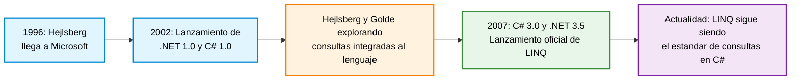
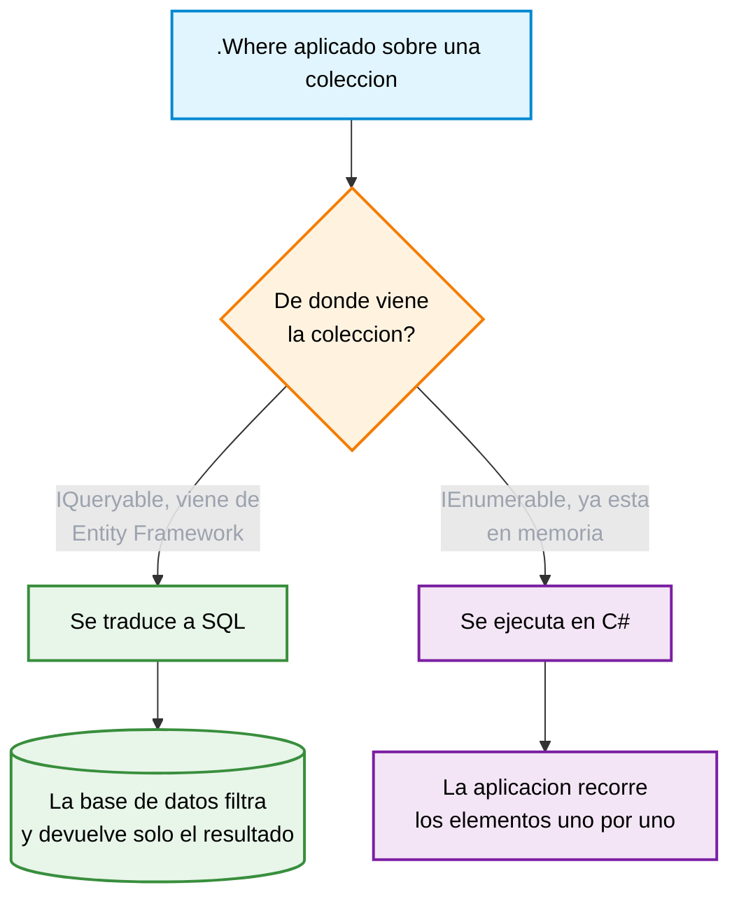
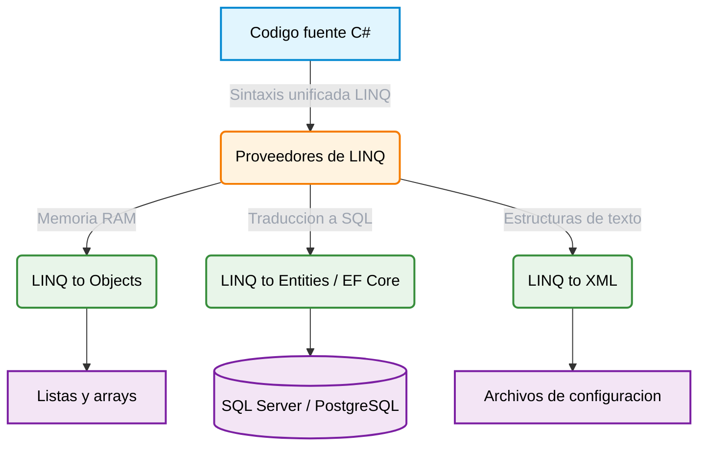

# Capítulo 1: ¿Qué es LINQ?

## 1. Historia: de dónde viene LINQ

Para entender por qué existe LINQ vale la pena retroceder un poco en el tiempo. C# fue diseñado por Anders Hejlsberg, el ingeniero danés que antes había creado Turbo Pascal y Delphi en Borland, y que Microsoft contrató en 1996 para liderar el diseño de un nuevo lenguaje, cuyo nombre interno era "Cool", que terminaría llamándose C#. La primera versión se lanzó junto con el .NET Framework 1.0 en 2002, y durante varios años el lenguaje creció incorporando funcionalidades clásicas de la programación orientada a objetos.

El salto que nos interesa ocurrió en 2007, con el lanzamiento de C# 3.0 junto al .NET Framework 3.5. La idea original surgió años antes, cuando Hejlsberg y Peter Golde, entonces a cargo del compilador de C#, comenzaron a explorar cómo integrar la consulta de datos directamente en el lenguaje. Las primeras versiones experimentales de esta idea ni siquiera se llamaban LINQ: usaban una sintaxis parecida a `sequence<Customer> locals = customers.where(ZipCode == 98112)`, donde "sequence" era un alias temprano de lo que hoy conocemos como `IEnumerable<T>`.

Esa propuesta fue tomando forma hasta convertirse en LINQ, y se lanzó junto con un paquete de características del lenguaje diseñadas específicamente para hacerla posible: expresiones lambda, el operador `var` para inferencia de tipos, métodos de extensión, tipos anónimos y árboles de expresión. Ninguna de estas piezas existía antes de 2007 de forma aislada; se construyeron como un conjunto para que LINQ pudiera funcionar.



Lo interesante es que, casi veinte años después, LINQ sigue siendo una de las señas de identidad más reconocibles de C#. Cuando alguien escribe hoy `_context.Estudiantes.Where(e => e.Edad > 18).ToList()`, está usando directamente ese conjunto de ideas que nació de una pregunta bastante simple: ¿por qué hay que aprender un lenguaje distinto, como SQL, para hacer algo tan cotidiano como filtrar una lista de datos?

---

## 2. Qué problema resuelve LINQ

LINQ (Language Integrated Query) es, formalmente, un conjunto de extensiones del lenguaje C# que permiten escribir consultas sobre datos usando una sintaxis nativa, en lugar de depender de un lenguaje externo como SQL incrustado en forma de texto.

Antes de su existencia, un desarrollador que necesitaba trabajar con tres fuentes de datos distintas terminaba aprendiendo, en la práctica, tres lenguajes distintos: SQL para consultar una base de datos relacional, XPath para navegar un documento XML, y bucles `for` o `foreach` manuales para recorrer listas en memoria. Cada uno con su propia sintaxis, sus propios errores típicos y su propia forma de fallar. LINQ nace para resolver justamente eso: ofrecer una única forma de escribir "dame los elementos que cumplan esta condición" sin que importe si esos elementos viven en SQL Server, en un archivo XML o en una simple `List<T>` que está en la memoria RAM del programa.

---

## 3. El tipado fuerte: por qué importa el momento en que se detecta un error

La diferencia más práctica entre escribir una consulta con LINQ y escribir SQL en texto plano dentro de C# no es de gustos, es de cuándo se entera el programador de que algo está mal.

Si alguien escribe una consulta tradicional como cadena de texto:

```csharp
string query = "SELECT Nombree FROM Estudiantes WHERE Edadd > 18";
```

el compilador no tiene forma de saber que `Nombree` o `Edadd` están mal escritos, porque para él esa línea es simplemente una cadena de caracteres como cualquier otra. El programa compila sin ninguna advertencia, y el error solo se manifiesta cuando el código se ejecuta y la base de datos responde con un mensaje de columna inexistente, generalmente en el peor momento posible: cuando el usuario final ya está usando el sistema.

Con LINQ, esa misma consulta se convierte en código que el compilador entiende de verdad:

```csharp
var adultos = _context.Estudiantes.Where(e => e.Edad > 18).ToList();
```

Aquí `e => e.Edad > 18` es una expresión lambda que opera directamente sobre la clase `Estudiante`. El compilador conoce esa clase y sus propiedades, y si alguien escribe `e.Edadd` por error, Visual Studio lo marca en rojo de inmediato, antes de que el programa siquiera intente ejecutarse. El error se mueve del "viernes en producción" al "mientras estás escribiendo el código", que es la diferencia que en la práctica ahorra más tiempo de depuración que cualquier otra característica del lenguaje.

---

## 4. IQueryable e IEnumerable: la decisión más importante que toma LINQ por debajo

Hay un concepto que conviene entender desde este primer capítulo, porque va a aparecer constantemente en los siguientes: la diferencia entre `IQueryable<T>` e `IEnumerable<T>`.

Ambas son interfaces que representan una colección de elementos sobre la que se puede iterar, pero resuelven el trabajo en lugares completamente distintos. `IEnumerable<T>` representa una colección que ya está en la memoria del programa; cuando se aplica un `Where` sobre un `IEnumerable`, ese filtro se ejecuta dentro de la aplicación, recorriendo los elementos uno por uno en C#. `IQueryable<T>`, en cambio, representa una consulta que todavía no se ha ejecutado; cuando se aplica un `Where` sobre un `IQueryable` que viene de Entity Framework, ese filtro no se procesa en C#, sino que se traduce a SQL y se envía a la base de datos, que es quien realmente filtra los datos antes de devolver el resultado.



La consecuencia práctica de esto es enorme. Si una consulta empieza como `IQueryable` y se llama a `.ToList()` demasiado pronto, todo lo que se encadene después de esa llamada deja de traducirse a SQL: pasa a ejecutarse en memoria, sobre el `IEnumerable` resultante. Por ejemplo:

```csharp
// Correcto: el filtro se traduce a SQL y la base de datos solo devuelve los que cumplen
var clientesActivos = _context.Clientes
    .Where(c => c.Activo)
    .ToList();

// Ineficiente: primero se descarga TODA la tabla a memoria, y el filtro se aplica despues en C#
var clientesActivos = _context.Clientes
    .ToList()
    .Where(c => c.Activo)
    .ToList();
```

Ambos fragmentos producen el mismo resultado final, pero el segundo descarga la tabla completa antes de filtrar, lo cual es inofensivo con cien registros y catastrófico con varios millones. Este es probablemente el error de rendimiento más común entre quienes recién empiezan con LINQ y Entity Framework, y la razón por la que en los capítulos siguientes se insiste en mantener las operaciones de filtrado, ordenamiento y agrupación encadenadas sobre el `IQueryable` el mayor tiempo posible, dejando el `.ToList()` para el final.

---

## 5. Ventajas y desventajas frente a las consultas tradicionales

| Criterio | Análisis |
| :--- | :--- |
| Ventajas | LINQ parametriza automáticamente los valores que entran a una consulta, lo que elimina el riesgo de inyección SQL sin que el desarrollador tenga que pensar en ello. También aprovecha el autocompletado de Visual Studio, ya que el editor conoce de antemano las propiedades disponibles. Y permite escribir prácticamente el mismo código sin importar si la base de datos detrás es SQL Server, MySQL o PostgreSQL, porque cada proveedor traduce las expresiones a su propio dialecto SQL. |
| Desventajas | Requiere dominar conceptos que no son triviales para quien recién aprende C#, como las expresiones lambda y los delegados. Y, como se explicó arriba, un mal entendimiento de cuándo se ejecuta realmente una consulta puede llevar a traer a memoria muchísimos más datos de los necesarios. |

---

## 6. Dónde vive cada tipo de LINQ dentro de una arquitectura en capas

A nivel de arquitectura, las consultas no se mezclan libremente en cualquier parte del código; cada tipo de LINQ tiene un lugar natural según el origen de los datos que está consultando. LINQ to Objects se usa típicamente en la Capa de Negocio, para filtrar o transformar colecciones que ya están cargadas en memoria, como una `List<T>` que llegó desde la Capa de Datos. LINQ to Entities, a través de Entity Framework, vive en la Capa de Datos: es el encargado de traducir el código C# a sentencias SQL optimizadas, específicas del motor de base de datos que se esté usando. LINQ to XML, menos frecuente en los proyectos de este manual, se usa para leer o construir archivos de configuración o de intercambio de datos en formato XML.



## 7. Referencias

* [1] Microsoft, "LINQ (Language-Integrated Query) (C#)," *Microsoft Learn*. [Online]. Disponible en: [https://learn.microsoft.com/es-es/dotnet/csharp/linq/](https://learn.microsoft.com/es-es/dotnet/csharp/linq/). [Accedido: 15-jun-2026].

* [2] Microsoft, "Cómo funcionan las consultas," *Entity Framework Core Documentation*. [Online]. Disponible en: [https://learn.microsoft.com/es-es/ef/core/querying/](https://learn.microsoft.com/es-es/ef/core/querying/). [Accedido: 15-jun-2026].

* [3] Microsoft, "Estilo de arquitectura de n niveles," *Azure Architecture Center*. [Online]. Disponible en: [https://learn.microsoft.com/es-es/azure/architecture/guide/architecture-styles/n-tier](https://learn.microsoft.com/es-es/azure/architecture/guide/architecture-styles/n-tier). [Accedido: 15-jun-2026].

* [4] Microsoft, "The Evolution of LINQ and its Impact on the Design of C#," *MSDN Magazine Archive*. [Online]. Disponible en: [https://learn.microsoft.com/en-us/archive/msdn-magazine/2007/june/the-evolution-of-linq-and-its-impact-on-the-design-of-csharp](https://learn.microsoft.com/en-us/archive/msdn-magazine/2007/june/the-evolution-of-linq-and-its-impact-on-the-design-of-csharp). [Accedido: 16-jun-2026].
